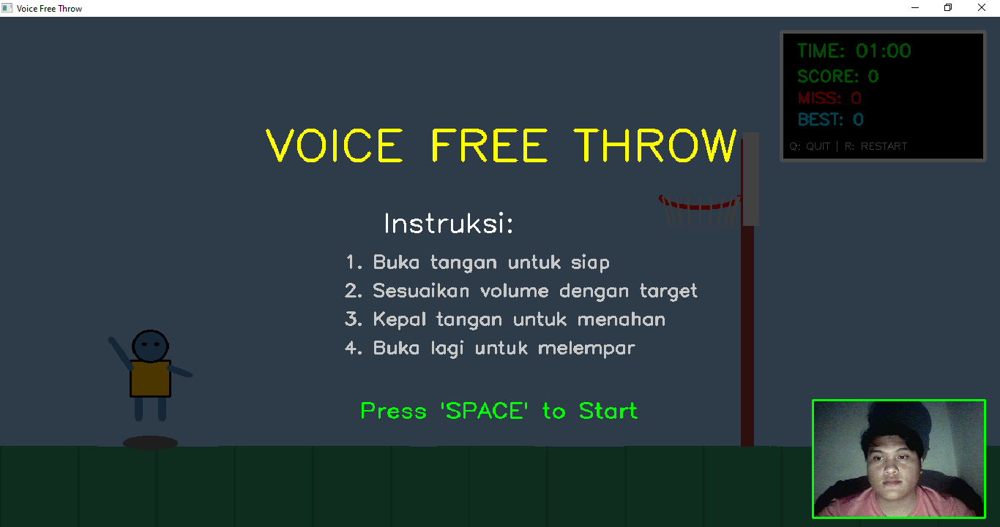
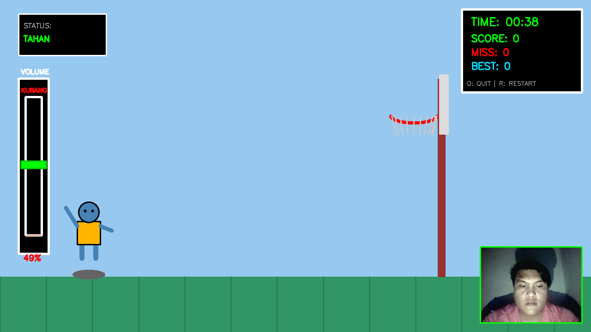
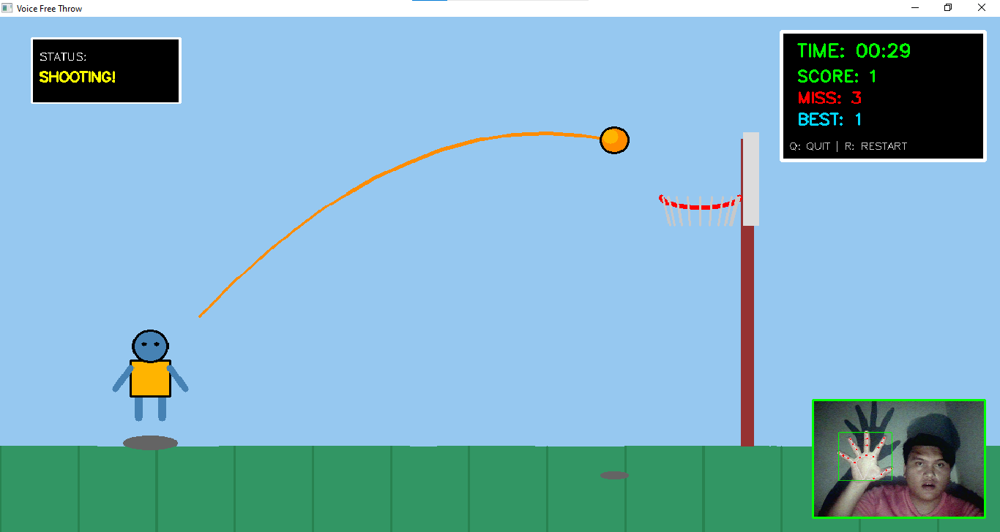
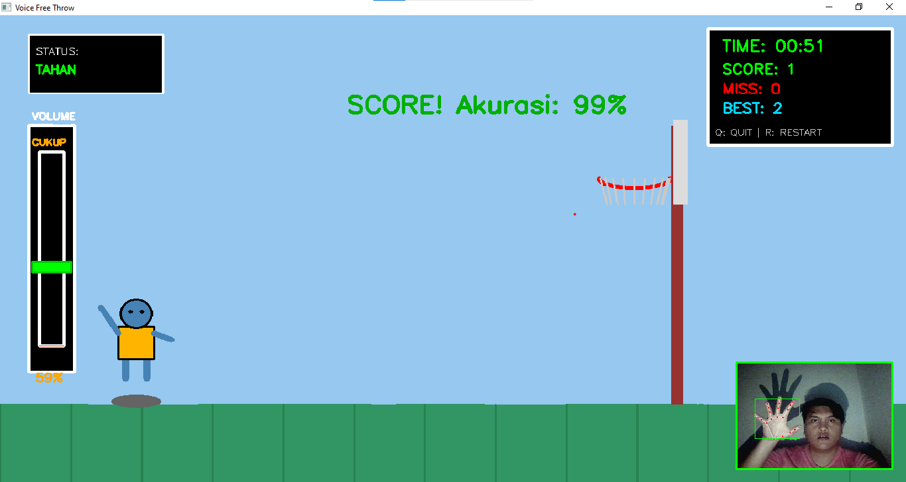
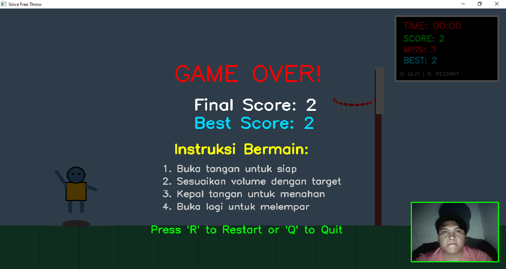

# 🏀 Voice Free Throw Basketball Game
### *Multimedia Voice-Controlled Basketball Mini Game*
### Tugas Besar Sistem Teknologi Multimedia

**Nama:** Reynaldi Cristian Simamora  
**NIM:** 122140116  
**Github :** [Anzensirc](https://github.com/anzensirc)  
**Mata Kuliah:** Sistem Teknologi Multimedia
**Kode MK : ** IF25-40305   
**Program Studi:** Teknik Informatika  
**Dosen Pengampu :** Martin C.T. Manullang

---

## 🎮 Deskripsi Singkat
**Voice Free Throw** adalah game mini berbasis Python yang memanfaatkan **audio processing**, **video processing**, dan **pose detection** untuk menciptakan pengalaman bermain basket yang unik menggunakan suara dan gerakan tangan sebagai kontrol utama.  
Pemain "menembak" bola menggunakan suara — seperti berteriak atau menghasilkan suara keras. Sistem mendeteksi intensitas audio dan menentukan apakah bola masuk atau tidak.

Game ini merupakan demonstrasi nyata penerapan teknologi multimedia:
- Audio signal processing
- Real-time video processing
- Pose estimation (MediaPipe)
- Interactive multimedia system

---

## 🎮 Tabel Fitur & Penerapan Teknologi Multimedia

| Kategori | Fitur / Teknologi | Penjelasan |
|---------|-------------------|------------|
| **🔊 Audio Processing** | Real-time microphone capture | Mengambil input suara secara langsung dari mikrofon menggunakan PyAudio |
| | RMS amplitude detection | Mengolah sinyal untuk menghitung kekuatan suara sebagai kontrol tembakan |
| | Noise filtering (deque rolling buffer) | Mengurangi noise melalui rata-rata bergulir agar input suara stabil |
| | Amplitude threshold trigger | Suara tertentu memicu aksi “shoot” pada game |
| | Sound effect (score, miss, best score) | Efek audio sebagai feedback interaktif |
| | Background music (BGM) | Musik latar selama permainan berjalan |
| **🎥 Video Processing & Overlay** | Webcam real-time | Menangkap video dari kamera untuk gameplay |
| | Rendering bola, ring, trajectory | Menggambar objek permainan secara real-time menggunakan OpenCV |
| | Overlay UI (score, timer, accuracy bar) | Menampilkan antarmuka permainan di atas video |
| | Alpha blending (game over) | Efek fade dengan transparansi untuk tampilan Game Over |
| | Frame-based graphics | Pengolahan frame demi frame untuk visual dinamis |
| **🧍 Pose Tracking** | Deteksi landmark tubuh | MediaPipe Pose melacak posisi tubuh pemain |
| | Skeleton tracking | Menghasilkan garis dan titik untuk memvisualkan pose pemain |
| | Penyesuaian animasi stickman | Stickman bergerak berdasarkan pose pemain |
| **🎮 Interactive multimedia system** | Kontrol suara | Pemain menembak menggunakan intensitas suara |
| | Accuracy bar | Bar bergerak yang menentukan timing ideal tembakan |
| | Game state dynamic | Scoring, miss, timer, dan best score tersinkronisasi |
| | Efek tembakan (Success/Miss) | Visual feedback setelah tembakan dilakukan |

---


## 📦 Dependency Utama
| Library    | Kegunaan                                    |
|------------|---------------------------------------------|
| OpenCV     | Video capture, overlay UI, drawing graphics |
| MediaPipe  | Pose estimation & landmark detection        |
| PyAudio    | Mengambil input mikrofon                    |
| NumPy      | Perhitungan numerik                         |
| Threading  | Audio stream paralel                        |
| PyGame     | Pemutar aset audio                          |

---

## 🛠️ Cara Clone & Menjalankan Game

### 1️⃣ Clone Repository
```bash
git clone https://github.com/anzensirc/Voice-Free-Throw.git
cd Voice-Free-Throw
```

### 2️⃣ Install Dependencies

Pastikan Python pada lokal atau conda 3.12+ atau 3.12.9 telah terpasang.
```bash
## Jika menggunakan conda aktifkan terlebih dahulu
conda activate env

## install requirements
pip install -r requirements.txt
```

3️⃣ Jalankan Game
```bash
python vft.py
```

### 🎮 Tata Cara / Guideline Bermain Game

Game ini dimainkan menggunakan **suara** dan **gerakan tubuh** yang ditangkap kamera.  
Ikuti panduan berikut agar gameplay berjalan maksimal:

---

## 🧩 1. Persiapan Sebelum Bermain
- Pastikan **webcam** aktif dan menghadap ke tubuh bagian atas.
- Pastikan **microphone** berfungsi dengan baik.
- Bermain di lingkungan yang **tidak terlalu berisik** agar deteksi suara akurat.
- Pastikan jarak yang cukup agar visual tangan terlihat
- Pastikan camera mendapat pencahayaan yang cukup.

---

## 🔊 2. Kontrol Game (Berbasis Suara dan Tangan)
Game ini menggunakan **kekuatan hembusan atau suara** untuk akurasi dan gerakan tangan untuk menembak.
- **Inisiasi tangan dengan jari direntangkan** untuk memulai.
- **Kepal Tangan** atau pose tos (kepalan menghadap ke kamera) untuk menahan.
- **Teriak kecil / hembuskan angin ke mikrofon** untuk mulai menyesuaikan akurasi bar dengan target.
- Semakin kuat suara → semakin tinggi indikator bar kekuatan tembakan.
- Untuk melepas tembakan **rentangkan kembali tangan** membentuk angka 5.
- Akurasi mendekati target menyebabkan akurasi tembakan membesar -> semakin besar kesempatan bola masuk ke ring.

---

## 🏀 3. Mekanik Permainan
- Setiap ronde akan menampilkan bar target acak.
- Pemain harus menembak pada momen yang tepat sesuai target tersebut.
- Game menilai tembakan menjadi:
  - **Success** → +1 skor
  - **Miss** → miss counter +1
- Jika mencetak skor tertinggi baru → muncul **Best Score SFX**.

---

## ⏲️ 4. Sistem Waktu
- Total waktu bermain: **60 detik**.
- Timer berjalan ketika game dimulai.
- Game otomatis berakhir saat waktu habis dan menampilkan **Game Over Menu**.

---

## 🔊 5. Indikator & UI yang Muncul
- **Accuracy Bar** → menentukan timing tembakan.
- **Score / Best Score** → di pojok layar.
- **Result Overlay** → teks "Success" atau "Miss" setelah tembakan.
- **Timer** → sisa waktu permainan.
- **Real - Time Camera Capture** -> pendeteksian gerakan tangan.

---

## 🎧 6. Audio Feedback
- **BGM** menyala saat permainan aktif.
- **SFX Score** → ketika bola masuk.
- **SFX Miss** → saat gagal.
- **SFX Best Score** → saat memecahkan rekor pribadi.

> Jika pygame tidak tersedia, audio otomatis dimatikan.

---

## 📌 7. Tips Bermain
- Gunakan suara yang **konsisten** untuk memicu tembakan.
- Bermain dengan pencahayaan yang baik
- Perhatikan **accuracy bar**—kunci kemenangan ada di timing.
- Bermain di ruangan tenang agar noise tidak memicu tembakan palsu.
- Gunakan headphone jika ingin menghindari umpan balik suara (feedback loop).

---

## 🏁 8. Mengakhiri Permainan
- Game akan otomatis berhenti saat timer habis dan masuk ke Game Over Menu.
- Tekan **q** kapan saja untuk keluar dari game.

---

## 📸 Screenshot Gameplay
### 1. Tampilan Menu Start

### 2. Tampilan Menahan Shoot

### 3. Tampilan Shooting

### 4. Tampilan Akurasi Setelah Shooting

### 5. Tampilan Menu Game Over



---
## 📘 Logbook Mingguan
| Hari | Kegiatan |
|------|----------|
| **Minggu 10 – Pencarian Ide dan Topik Porjek** | Pencarian informasi filter pada mediasosial yang antimainstream |
| **Minggu 11 - Penyampaian Topik** | Konfirmasi Topik dan persetujuan Topik serta inisiasi penginstalan modul |
| **Minggu 15 - Pemahaman terkait PyGame dan Model** | Proses eksperimern PyGame dan Model mediapipe untuk impelemntasi landmark tangan |
| **Minggu 16 - Pengerjaan Kode dan Laporan** | - Pembuatan Github <br>- Pencarian aset <br>- Implementasi landmark dan audio processing untuk kontroler utama<br> - Membuat layout game<br>- Implementasi Bar Akurasi dan video real-time<br>- Implementasi aset dan Penyempurnaan logika game <br>- Pembuatan indikator informasi dan menu<br>- Penulisan laporan<br>|

---

## 🤝 Kontribusi
Silakan fork dan buat pull request untuk pengembangan lebih lanjut.

---

### ⭐ Jika proyek ini bermanfaat, jangan lupa beri ⭐ di GitHub!